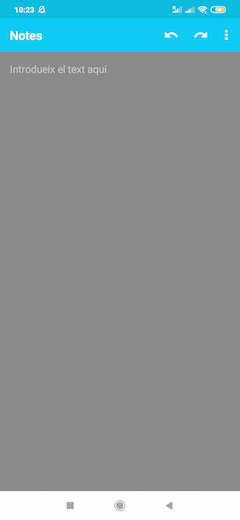

# NoxSTT

(Jump to [English](#English))

### [Português]

> **Nota: Este aplicativo é uma prova de conceito no momento**

NoxSTT é um aplicativo Android que fornece serviços de reconhecimento automático de fala sem precisar de conexão com a internet, pois todo o processamento é feito localmente no seu telefone.

Isso é possível graças a:
- um RecognitionService envolvendo a biblioteca Vosk
- um RecognitionService envolvendo a biblioteca DeepSpeech da Mozilla 
- uma atividade que lida com intenções RECOGNIZE_SPEECH entre outras

O código atualmente é apenas um PoC fortemente baseado em::
- [Kõnele](https://github.com/Kaljurand/K6nele)
- [Vosk Android Demo](https://github.com/alphacep/vosk-android-demo)
- [LocalSTT](https://github.com/ccoreilly/LocalSTT)

O NoxSTT deve funcionar com todos os teclados e aplicativos que implementam o reconhecimento de fala por meio da intenção RECOGNIZE_SPEECH ou da classe SpeechRecognizer do Android. Foi testado com sucesso usando os seguintes aplicativos no Android 9:
- [Tasker](https://tasker.joaoapps.com)
- [AnySoftKeyboard](https://github.com/AnySoftKeyboard/AnySoftKeyboard)
- [Kõnele](https://github.com/Kaljurand/K6nele)
- [SwiftKey](https://www.swiftkey.com)

Se você quiser usar o aplicativo com o seu idioma, basta substituir os modelos em `app/src/main/assets/sync` e recompilar o aplicativo.

### [English]

> **Note: This application is just a proof of concept for now**

NoxSTT is an Android application that provides automatic speech recognition services without needing internet connection as all processing is done locally on your phone.

This is possible thanks to:
- a RecognitionService wrapping the Vosk library
- a RecognitionService wrapping Mozilla's DeepSpeech library
- an Activity that handles RECOGNIZE_SPEECH intents amongst others

The code is currently just a PoC strongly based on:
- [Kõnele](https://github.com/Kaljurand/K6nele)
- [Vosk Android Demo](https://github.com/alphacep/vosk-android-demo)
- [LocalSTT](https://github.com/ccoreilly/LocalSTT)

NoxSTT should work with all keyboards and applications implementing speech recognition through the RECOGNIZE_SPEECH intent or Android's SpeechRecognizer class. It has been successfully tested using the following applications on Android 9:
- [Tasker](https://tasker.joaoapps.com)
- [AnySoftKeyboard](https://github.com/AnySoftKeyboard/AnySoftKeyboard)
- [Kõnele](https://github.com/Kaljurand/K6nele)
- [SwiftKey](https://www.swiftkey.com)

If you want to use the application with your language just replace the models in `app/src/main/assets/sync` and rebuild the application.

### Demo (LocalSTT)

